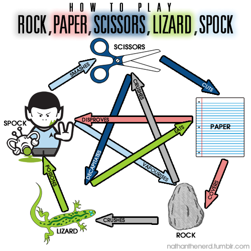

## Requisitos

- El jugador comenzará el juego y seleccionará una opción piedra, papel, tijera
- El ordenador seleccionará otra opción.
- Decidir quién gana.

## Más requisitos

- Incluye lagarto y spock  
- Ten un contador de cuántas veces has ganado.
- Guarda los datos en una cookie
- Mejora la UI

## ¿Cómo ejecutarlo?

```shell script
npm install
npm run dev
```
